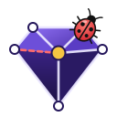
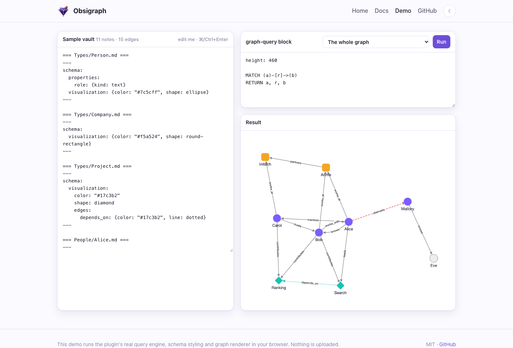
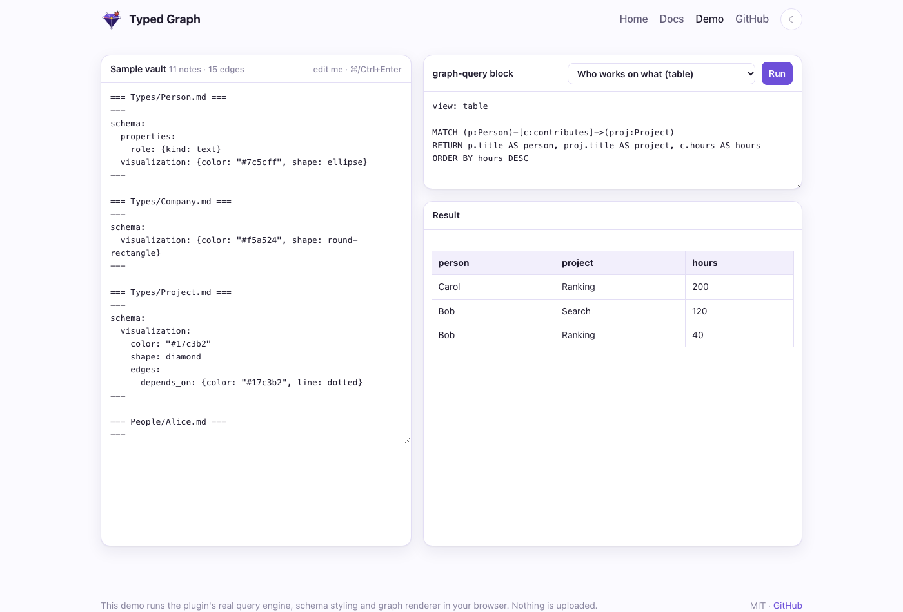
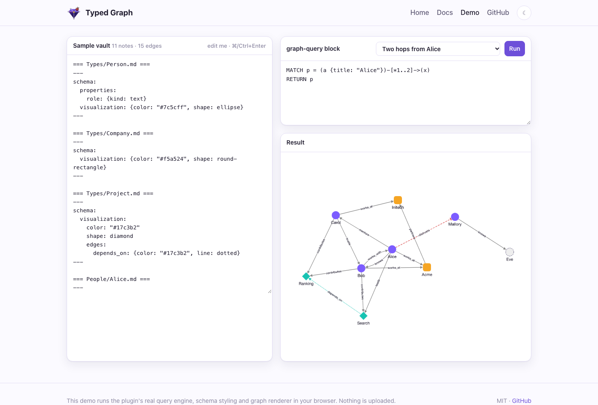
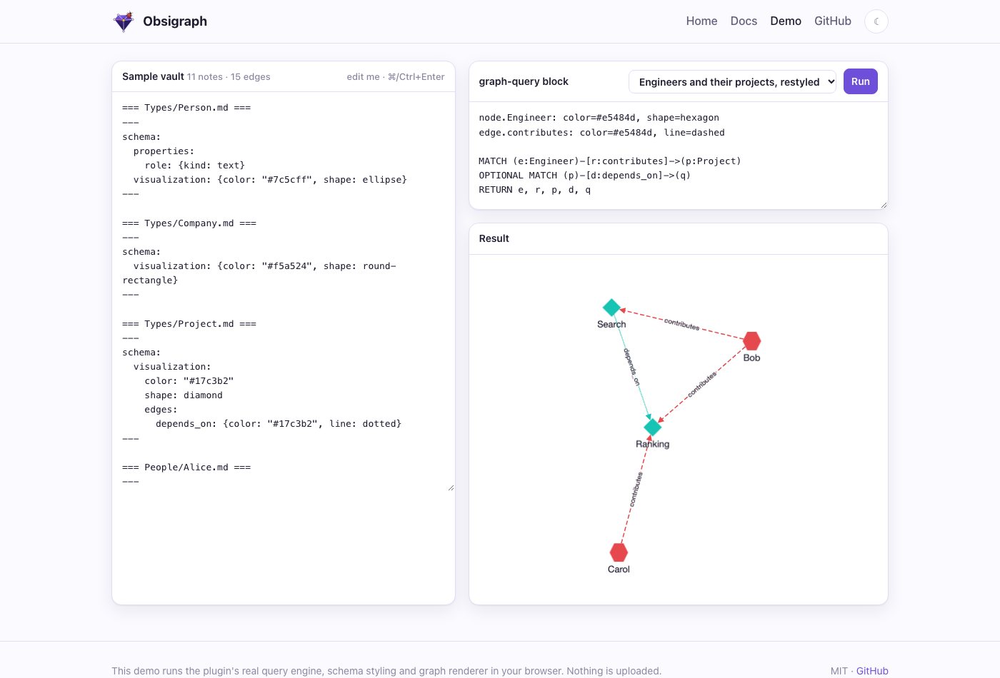
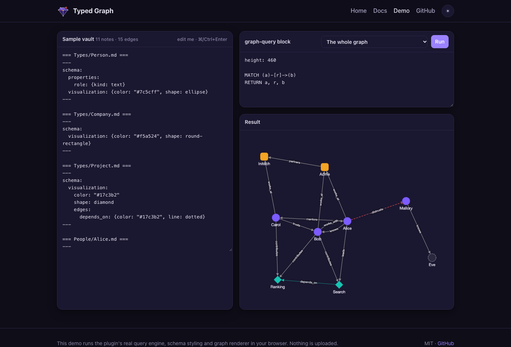

<p align="center">
  
</p>

<h1 align="center">Obsigraph</h1>

<p align="center">
  <strong>Your Obsidian notes as a real graph</strong>: typed, signed, labeled edges with properties, openCypher queries, a graph view that shows what it means, and RAG-ready storage for agents.
</p>

<p align="center">
  <a href="https://volland.github.io/obsigraph/demo.html"><b>Live demo</b></a> ·
  <a href="https://volland.github.io/obsigraph/docs.html">Docs</a> ·
  <a href="https://volland.github.io/obsigraph/">Website</a> ·
  <a href="https://github.com/Volland/obsigraph/releases/latest">Download</a>
</p>

<p align="center">
  <a href="https://github.com/Volland/obsigraph/releases/latest"></a>
  <a href="LICENSE"></a>
  
</p>



## Why

Obsidian links say *that* two notes are related, not *how*. Obsigraph lets one line say how:

```markdown
---
type: Person
---
knows:: [[Bob]] {since: 2020, label: "met at NeurIPS"}
works_at:: [[Acme]]
-distrusts:: [[Mallory]]
```

Then you can ask the vault questions in openCypher, inside any note:

````markdown
```graph-query
MATCH (p:Person)-[c:contributes]->(proj:Project)
RETURN p.title AS person, proj.title AS project, c.hours AS hours
ORDER BY hours DESC
```
````

## Features

- **Typed, signed edges with properties.** `type:: [[Target]] {props}` works like Graph Link Types, so your existing lines keep working. A `-` prefix makes an edge negative, and edges can have stable or pinned ids.
- **Typed nodes and schema notes.** Frontmatter `type` gives a note its labels. A note in `Types/` declares a type's properties, allowed edges, template and look.
- **openCypher queries.** `MATCH`, `OPTIONAL MATCH`, `WITH`, aggregates, variable-length paths and path variables. Queries are read-only and errors are clear.
- **Graph or table, live.** Results render as a labeled, styled graph or a table, and refresh as you edit.
- **Graph view.** A full-pane explorer that follows the active note, expands neighbors and explains where each style comes from.
- **Edge embeds.** `{{edge: Alice -knows-> Bob . since}}` shows an edge's property inside your prose.
- **Optional sidecar.** A LadybugDB mirror for full Cypher, local vector search (Ollama), GraphRAG with citations, and an **MCP server** for agents.

| | |
|---|---|
|  |  |
|  |  |

*The screenshots come from the [live demo](https://volland.github.io/obsigraph/demo.html), which runs the plugin's own query engine, schema styling and renderer in your browser.*

## Install

- **Community plugins** (once listed): open **Settings → Community plugins → Browse**, search for *Obsigraph*, then install and enable it.
- **BRAT** (before it's listed): install *Obsidian42 - BRAT*, run **Add a beta plugin**, and enter `Volland/obsigraph`.
- **Manually**: download `main.js`, `manifest.json` and `styles.css` from the [latest release](https://github.com/Volland/obsigraph/releases/latest) into `<vault>/.obsidian/plugins/obsigraph/`, reload Obsidian, and enable the plugin.

The plugin works on desktop and mobile, and it never modifies your notes.

## Quick start

1. Add `type: Person` to a note's frontmatter.
2. Write an edge line such as `knows:: [[Bob]] {since: 2020}`.
3. Add a `graph-query` block with `MATCH (a:Person)-[r:knows]->(b) RETURN a, r, b`.
4. Run **Obsigraph: Open graph view** to explore.

The full guide covers edge syntax, schema notes, styling precedence, the Cypher subset, embeds and settings: **[volland.github.io/obsigraph/docs.html](https://volland.github.io/obsigraph/docs.html)**.

## For agents: the sidecar

`packages/sidecar` is a headless service over a read-only copy of your vault. It needs no Obsidian. It offers REST, an MCP server, a LadybugDB mirror, local vector search and GraphRAG.

```bash
npm install && npm run build:sidecar
claude mcp add obsigraph \
  -e OBSIGRAPH_VAULT=/path/to/vault -e OBSIGRAPH_DATA=/path/to/data \
  -- node packages/sidecar/dist/server.mjs --stdio
```

The MCP tools are `cypher_query`, `vector_search` and `graphrag_retrieve`, all read-only. For REST endpoints, Docker and environment variables, see the [sidecar docs](https://volland.github.io/obsigraph/docs.html#sidecar).

## Development

```text
packages/core     edge parser, graph model, schemas, styles, openCypher engine, embeddings (no Obsidian APIs)
packages/plugin   the Obsidian plugin
packages/sidecar  headless REST + MCP service, LadybugDB mirror, vector index, conformance suite
site/             the website and live demo (GitHub Pages)
lat.md/           architecture and test specs (lat.md)
openspec/         specs and archived changes (OpenSpec)
```

```bash
npm install
npm run verify                      # typecheck + tests + lat check
OBSIGRAPH_OUT="<vault>/.obsidian/plugins/obsigraph" npm run build   # build the plugin into a vault
npm run site:build && npx serve site                                 # preview the website
```

### Releasing

1. Run `npm run version:bump -- 0.5.0`. This updates `manifest.json`, `versions.json` and every package version.
2. Commit, then run `git tag 0.5.0 && git push origin 0.5.0`. The tag has no `v` prefix.
3. The **Release plugin** workflow typechecks, tests, builds, and attaches `main.js`, `manifest.json` and `styles.css` to the GitHub release.

### Submitting to the Obsidian community directory

Obsidian takes submissions through its web directory, not through pull requests. `community-plugins.json` in `obsidianmd/obsidian-releases` is only a mirror of it.

1. Sign in at [community.obsidian.md](https://community.obsidian.md) with your Obsidian account, and link your GitHub account to prove you own the repo.
2. Add the plugin from the `Volland/obsigraph` repository. The directory reads `README.md`, `LICENSE` and the root `manifest.json`, and installs from the GitHub release tagged with the manifest version.
3. An automated review runs. To fix anything it reports, update the repo and publish a new release with a higher version (`npm run version:bump`, then push the tag).

## License

[MIT](LICENSE) © Volodymyr Pavlyshyn. Not affiliated with Obsidian or LadybugDB.
